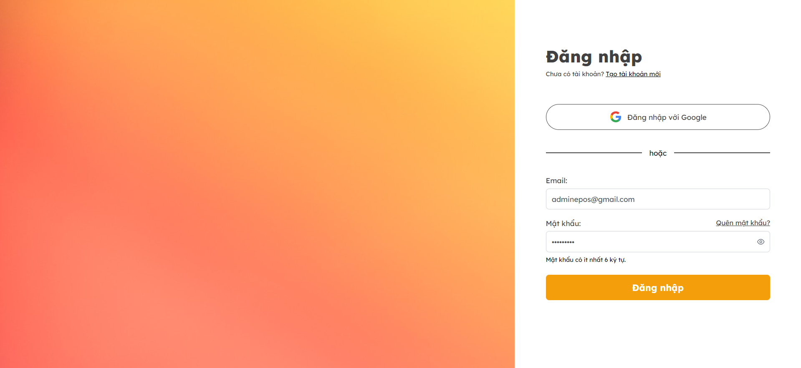
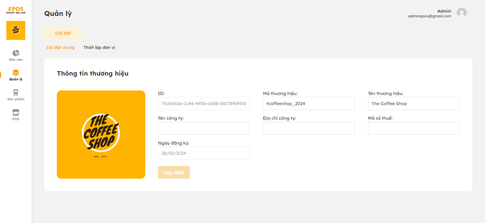
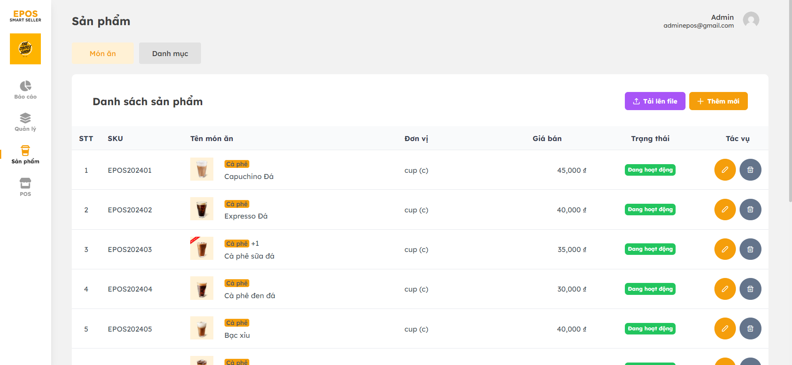
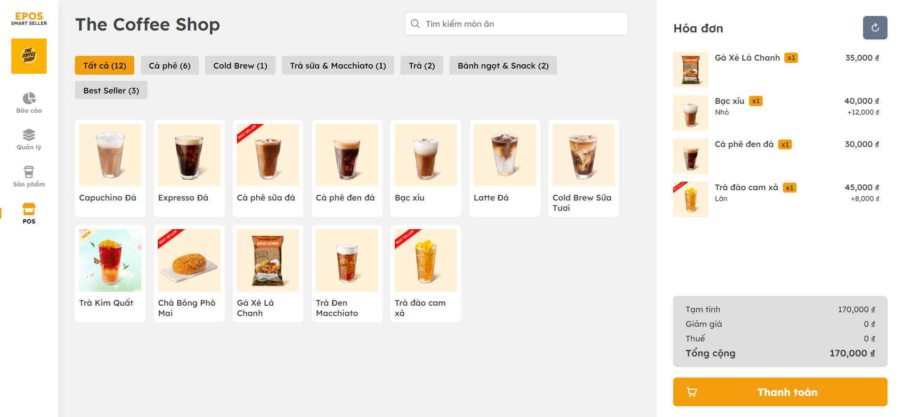

## ePOS Dashboard
###### A personal web application project on sales for coffee or food store
###### Completion time is about 1.5 months

### Backend
- .NET 6 Web API
- SQL Sever 2022
- JWT Bearer
- Clean Architecture, CQRS Pattern, REPR Pattern

### Frontend:
- Angular 17
- NgRx 17
- PrimeNG, Tailwind

### Review

